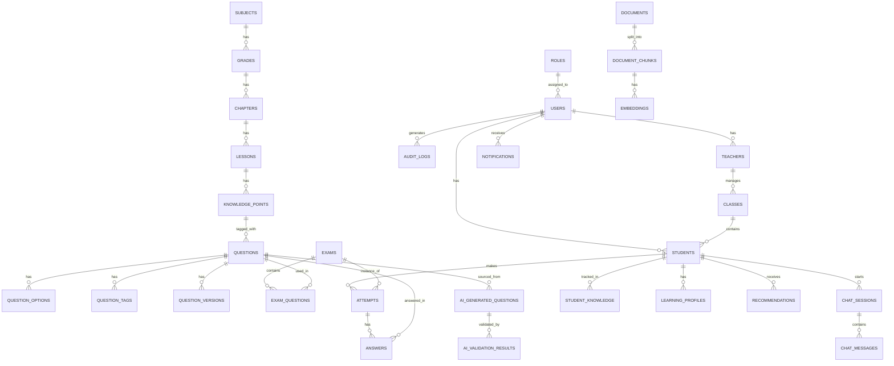

# CHEMGENIE — PHASE 0: SYSTEM ANALYSIS

> Trạng thái: **PHASE 0 hoàn tất. Chờ xác nhận "LÀM PHASE 1" để bắt đầu triển khai code.**

---

## 1. FUNCTIONAL REQUIREMENTS

### 1.1 Authentication & Authorization
- FR-01: Đăng ký/đăng nhập bằng email + mật khẩu (hash bằng bcrypt/argon2).
- FR-02: JWT Access Token (ngắn hạn) + Refresh Token (dài hạn, lưu hashed trong DB, hỗ trợ revoke).
- FR-03: Phân quyền theo role: `STUDENT`, `TEACHER`, `ADMIN` (RBAC, middleware kiểm tra ở API layer).

### 1.2 Student
- FR-10: Xem môn/lớp/chương/bài học.
- FR-11: Làm bài luyện tập, làm đề thi (practice, mock, teacher-assigned, AI-generated).
- FR-12: Hỏi AI Tutor (có RAG), nhận gợi ý theo từng bước thay vì đáp án ngay.
- FR-13: Xem điểm, lịch sử làm bài, tiến độ, năng lực theo từng chủ đề (`knowledge_mastery`).
- FR-14: Nhận đề xuất học tập cá nhân hóa (weak topic → lesson/question/exam).

### 1.3 Teacher
- FR-20: Quản lý lớp, danh sách học sinh.
- FR-21: Tạo/sửa câu hỏi thủ công; dùng AI sinh câu hỏi theo tham số (chương, độ khó, số lượng).
- FR-22: Duyệt câu hỏi AI sinh ra (approve/reject/edit) dựa trên kết quả Validator.
- FR-23: Tạo đề thi, giao bài cho lớp/học sinh.
- FR-24: Xem thống kê lớp: điểm trung bình, tỉ lệ hoàn thành, lỗi sai phổ biến, kiến thức yếu chung.
- FR-25: AI Assistant dạng chat lệnh ("Tạo đề 20 câu lớp 12 chương Ester").

### 1.4 Admin
- FR-30: Quản lý user (khóa/mở, đổi role), quản lý môn/chương/bài/câu hỏi.
- FR-31: Quản lý Knowledge Base (upload tài liệu, gắn metadata, approve nguồn).
- FR-32: Cấu hình AI (provider, model, trọng số validator, ngưỡng điểm auto-publish).
- FR-33: Xem system/audit logs.

### 1.5 AI Subsystems
- FR-40: RAG trả lời có context, có thể nói "chưa đủ dữ liệu" thay vì bịa.
- FR-41: Sinh câu hỏi theo schema JSON cố định, không tự do format.
- FR-42: Validator nhiều tầng, tính `overall_score`, gán status (`REJECT` / `PENDING_REVIEW` / `APPROVED_CANDIDATE`).
- FR-43: Không tự động publish câu hỏi AI nếu chưa đạt ngưỡng cấu hình.

### 1.6 Exam Engine
- FR-50: Đếm giờ, auto-save, submit, chấm điểm **server-side only**.
- FR-51: Thống kê sau khi nộp bài, xem lại đáp án + lời giải.

---

## 2. NON-FUNCTIONAL REQUIREMENTS

| Loại | Yêu cầu |
|---|---|
| Hiệu năng | API p95 < 500ms cho các endpoint không gọi LLM; retrieval RAG < 1.5s |
| Khả năng mở rộng | Backend stateless, scale ngang qua Docker; DB có index đầy đủ |
| Bảo mật | JWT, hashing password, input validation (Pydantic/Zod), rate limiting, CORS whitelist |
| Độ tin cậy | Không mất dữ liệu bài làm (transaction + auto-save); retry/backoff khi gọi LLM |
| Khả năng bảo trì | Kiến trúc layered (route → service → repository), type-safe toàn hệ thống |
| Khả năng kiểm thử | Coverage tối thiểu cho auth, chấm điểm, validator |
| Chi phí AI | Giới hạn token, cache câu trả lời lặp, log chi phí ước tính mỗi request |
| Khả năng quan sát | Structured logging, request ID, AI request ID |
| Đa nền tảng | Web responsive (desktop/tablet/mobile) + Mobile app dùng chung API |

---

## 3. SYSTEM ARCHITECTURE

```text
                         ┌─────────────────────────┐
                         │        CLIENTS          │
                         │  Web (Next.js)  Mobile   │
                         │              (Flutter)   │
                         └────────────┬─────────────┘
                                      │ HTTPS / REST (JWT)
                         ┌────────────▼─────────────┐
                         │      FastAPI Backend      │
                         │  Routers → Services →     │
                         │  Repositories → ORM        │
                         └───┬────────┬──────────┬────┘
                             │        │          │
                  ┌──────────▼──┐ ┌───▼───┐ ┌────▼─────────┐
                  │ PostgreSQL  │ │ Redis │ │ AI Module    │
                  │ (+pgvector) │ │ Cache/│ │ (Provider     │
                  │             │ │ Queue │ │  Abstraction) │
                  └─────────────┘ └───┬───┘ └────┬─────────┘
                                      │           │
                              ┌───────▼───┐  ┌────▼────────┐
                              │ Celery/RQ │  │ RAG Pipeline │
                              │ Workers   │  │ + Validator  │
                              └───────────┘  └──────────────┘
```

Nguyên tắc: mọi truy cập LLM chỉ diễn ra ở backend; frontend/mobile không bao giờ giữ API key.

---

## 4. DATABASE ERD (Mermaid)



Ghi chú thiết kế:
- `question_versions` để hỗ trợ chỉnh sửa có lịch sử (audit khi giáo viên sửa câu AI sinh).
- `student_knowledge` lưu `knowledge_point_id`, `mastery_score`, `updated_at` — nguồn cho recommendation.
- `embeddings` dùng `pgvector` (cột `vector(1536)` hoặc tuỳ model), có index `ivfflat`.
- Tất cả bảng có `created_at`, `updated_at`; khóa ngoại có `ON DELETE` rule tường minh (đa số `RESTRICT`/`CASCADE` tùy quan hệ sở hữu).

---

## 5. API ARCHITECTURE

```text
/api/v1/auth              POST /register, /login, /refresh, /logout
/api/v1/users              GET/PATCH profile, admin CRUD
/api/v1/subjects,/grades,/chapters,/lessons   CRUD (teacher/admin write, all read)
/api/v1/questions          CRUD, search, filter
/api/v1/exams              CRUD, /start, /submit, /result
/api/v1/attempts           GET history, GET detail
/api/v1/chat               POST message, GET session history
/api/v1/rag                POST query (internal, dùng bởi chat), admin: /documents CRUD
/api/v1/ai/questions       POST generate (async job → Celery), GET status
/api/v1/ai/validation      GET results theo question_id
/api/v1/recommendations    GET cho student hiện tại
/api/v1/analytics          GET teacher/admin dashboards
```

Chuẩn hóa:
- Response bao bọc `{ success, data }` hoặc `{ success:false, error:{code,message} }`.
- OpenAPI tự sinh từ FastAPI (`/docs`, `/openapi.json`).
- Versioning qua prefix `/api/v1` để mở rộng sau này.
- Các job AI sinh câu hỏi chạy **bất đồng bộ** (Celery) vì có thể mất nhiều giây → tránh block request.

---

## 6. AI ARCHITECTURE

```text
ai/
├── providers/
│   ├── base.py            # interface: generate(), embed()
│   ├── openai_provider.py
│   ├── gemini_provider.py
│   └── local_provider.py
├── prompts/
│   ├── tutor.py
│   ├── question_generator.py
│   ├── validator.py
│   ├── solution.py
│   └── recommendation.py
├── rag/
├── validation/
└── config.py               # model, temperature, token limit, weights
```

Nguyên tắc: business logic (service layer) chỉ gọi qua interface `LLMProvider`, không import trực tiếp SDK của OpenAI/Gemini → đổi provider chỉ cần đổi config, không sửa code nghiệp vụ.

---

## 7. RAG ARCHITECTURE

```text
Document (PDF/DOCX/text đã duyệt)
  → Parser (trích text + cấu trúc)
  → Cleaning (bỏ header/footer rác)
  → Chunking (theo đoạn/heading, ~300–500 token, overlap ~50)
  → Metadata (grade, chapter, lesson, topic, source, approved)
  → Embedding (qua LLMProvider.embed())
  → Lưu vào bảng embeddings (pgvector)

Truy vấn:
  query → embedding → top-k (cosine similarity) → (rerank tùy chọn)
  → lọc theo metadata (grade/chapter nếu xác định được từ câu hỏi)
  → build context (giới hạn tổng token) → đưa vào tutor_prompt → LLM
```

Chỉ nội dung có `approved = true` mới được đưa vào retrieval cho học sinh.

---

## 8. AI QUESTION GENERATION PIPELINE

```text
Input (grade, chapter, topic, số lượng, difficulty_distribution, type, competency)
  → question_generation_prompt + knowledge_context (RAG, tùy chọn)
  → LLM (structured output / JSON schema bắt buộc)
  → Parse & Schema Validation (Pydantic)
  → Lưu vào ai_generated_questions (status = AI_GENERATED)
  → Đưa vào hàng đợi Validator (Section 9)
```

Không chấp nhận output không đúng JSON schema — reject và log lỗi để retry có kiểm soát (tối đa N lần).

---

## 9. QUESTION VALIDATION PIPELINE

```text
Layer 1  JSON/Schema validation
Layer 2  Rule-based validation (đủ số option, đúng 1 đáp án cho SINGLE_CHOICE, v.v.)
Layer 3  Chemical equation validation (cân bằng phương trình, tính hợp lệ công thức)
Layer 4  Numerical calculation validation (đối chiếu lại phép tính bằng công cụ, không tin LLM)
Layer 5  LLM semantic validation (tính hợp lý, rõ ràng đề bài)
Layer 6  Duplicate detection (so khớp embedding với câu hỏi đã có)
Layer 7  Teacher review (con người quyết định cuối cùng)
```

`overall_score` = 0.30·chemical_accuracy + 0.20·answer_consistency + 0.15·logical_consistency + 0.15·curriculum_alignment + 0.10·difficulty_score + 0.10·language_quality — **trọng số nằm trong bảng config, admin chỉnh được, không hard-code.**

Quy tắc quyết định (ngưỡng cũng cấu hình được):
- Điểm thấp → `REJECT`
- Điểm trung bình → `PENDING_REVIEW`
- Điểm cao → `APPROVED_CANDIDATE` (vẫn cần giáo viên duyệt trước khi `PUBLISHED`)
- Nhiều đáp án đúng / không có đáp án đúng / sai chương trình → `REJECT` ngay, không tính điểm.

---

## 10. STUDENT LEARNING PIPELINE

```text
Attempt câu hỏi → ghi (accuracy, response_time, topic, difficulty, mistake_type)
  → cập nhật student_knowledge.mastery_score theo knowledge_point
    (phương pháp: trung bình trọng số theo thời gian — weighted moving average,
     có ghi rõ công thức trong docs/research.md, KHÔNG gọi là "AI cá nhân hóa"
     nếu chỉ là công thức thống kê đơn giản)
  → xác định weak_topic (mastery_score dưới ngưỡng cấu hình)
  → recommendation engine sinh gợi ý: lesson / bộ câu hỏi / đề ôn tập
  → hiển thị trên Student Dashboard
```

---

## 11. WEB ARCHITECTURE (Next.js)

```text
apps/web/
├── app/                 # routing (App Router), theo route đã liệt kê ở XX
├── components/          # UI dùng chung (shadcn/ui)
├── features/            # theo domain: auth, exam, question-bank, ai-tutor...
├── hooks/                # React Query hooks
├── lib/                  # axios/fetch client, zod schemas
├── services/             # gọi API, tách khỏi component
├── types/
└── tests/
```

State: React Query cho server state, không dùng Redux trừ khi thật cần. Form + validate bằng React Hook Form + Zod (đồng bộ schema với Pydantic backend về mặt logic).

---

## 12. FLUTTER ARCHITECTURE

```text
apps/mobile/lib/
├── core/        # constants, error handling, network client (Dio)
├── config/      # env, theme
├── data/        # datasources (API), models, repositories impl
├── domain/      # entities, repository interfaces, usecases
├── presentation/# screens, widgets, state (Riverpod)
└── routing/     # GoRouter
```

Clean Architecture 3 lớp (data/domain/presentation), dùng chung REST API với web, không viết logic nghiệp vụ riêng (ví dụ: chấm điểm luôn ở server).

---

## 13. FOLDER STRUCTURE (Monorepo)

```text
chemgenie/
├── apps/{web,mobile}/
├── backend/app/{main.py,core,db,models,schemas,api,services,repositories,ai,rag,validation,utils}
├── database/         # SQL scripts, seed
├── docs/
├── scripts/
├── tests/
├── docker/
├── .env.example
├── docker-compose.yml
├── README.md
└── LICENSE
```
(Chi tiết đầy đủ theo đúng cấu trúc đã liệt kê trong tài liệu gốc, mục IV.)

---

## 14. DEVELOPMENT ROADMAP

| Phase | Nội dung | Điều kiện qua phase |
|---|---|---|
| 0 | System analysis (tài liệu này) | Đã xác nhận |
| 1 | Backend foundation: FastAPI, Postgres, Alembic, JWT, RBAC, Docker | Chạy được, có test auth |
| 2 | Content + Question Bank (CRUD môn/chương/bài/câu hỏi) | CRUD hoạt động, có seed |
| 3 | Exam System (tạo đề, làm bài, chấm server-side) | Luồng thi end-to-end |
| 4 | Web frontend (Next.js) | Các route chính hoạt động |
| 5 | Flutter mobile | Đăng nhập + làm bài cơ bản |
| 6 | RAG (ingest tài liệu, retrieval) | Truy vấn trả context đúng |
| 7 | AI Tutor | Hỏi-đáp có trích dẫn nguồn |
| 8 | AI Question Generator | Sinh câu hỏi theo schema |
| 9 | Question Validator (7 layer) | Điểm số + status đúng logic |
| 10 | Personalized Learning | mastery_score + recommendation |
| 11 | Analytics (Teacher/Admin dashboard) | Số liệu chính xác |
| 12 | Testing toàn diện | Coverage các luồng cốt lõi |
| 13 | Deployment (Docker Compose) | Toàn hệ thống chạy bằng `docker compose up` |

---

## 15. SECURITY PLAN

- Input validation ở cả 2 lớp (Pydantic backend, Zod frontend).
- Chống SQL injection: dùng ORM (SQLAlchemy) tham số hóa, không raw string query.
- Chống XSS: sanitize nội dung hiển thị (đặc biệt câu hỏi do AI sinh trước khi publish).
- CORS: whitelist origin theo `.env`.
- Rate limiting theo IP/user (đặc biệt endpoint AI để chống lạm dụng chi phí).
- JWT: access token hết hạn ngắn (~15 phút), refresh token rotate + revoke list trong Redis.
- RBAC: decorator/dependency kiểm tra role ở mọi route nhạy cảm.
- Secret management: toàn bộ key qua biến môi trường, không commit `.env`.
- Audit log cho hành động nhạy cảm (đổi role, publish câu hỏi, xóa dữ liệu).

---

## 16. TESTING STRATEGY

- Backend: `pytest` — unit test cho services (validator, scoring, recommendation) + integration test cho API (auth, question CRUD, exam submit).
- Frontend: unit test component quan trọng + integration test luồng làm bài thi.
- Flutter: `flutter test` cho widget đăng nhập, làm bài.
- Bắt buộc bao phủ: Authentication, Authorization, Question creation/generation/validation, Exam creation/submission/scoring, AI Tutor (mock LLM), RAG retrieval (mock embedding), Recommendation.
- AI-liên quan: test bằng LLM provider giả lập (fake/mock) để không tốn chi phí và kết quả tất định khi chạy CI.

---

## 17. RESEARCH EXPERIMENT DESIGN

Mục tiêu nghiên cứu (phù hợp bối cảnh đề tài KHKT):
- So sánh **LLM thuần** vs **LLM + RAG** về độ chính xác/độ liên quan câu trả lời AI Tutor.
- So sánh **AI Question Generator thuần** vs **+ Validator 7 lớp** về tỉ lệ câu hỏi bị giáo viên từ chối.
- Thiết kế Pre-test / Intervention (dùng CHEMGENIE) / Post-test để đánh giá hiệu quả học tập — **không tuyên bố quan hệ nhân quả mạnh nếu không có nhóm đối chứng đủ lớn**; báo cáo rõ giới hạn thiết kế.
- Xuất dữ liệu nghiên cứu (đã anonymize) dạng CSV/JSON: kết quả AI generation, kết quả validation, đánh giá của giáo viên, kết quả attempt của học sinh.

---

## 18. RISK ANALYSIS

| Rủi ro | Mức độ | Giảm thiểu |
|---|---|---|
| LLM sinh câu hỏi sai kiến thức hóa học | Cao | Validator nhiều lớp + rule-based + con người duyệt cuối |
| Chi phí gọi LLM vượt kiểm soát | Trung bình | Token limit, cache, rate limit, async queue |
| Lộ API key | Cao (nếu xảy ra) | Chỉ backend giữ key, không log key, secret qua env |
| Học sinh gian lận khi thi (đổi đáp án client) | Cao | Chấm điểm và lưu đáp án đúng chỉ ở server |
| Dữ liệu tài liệu vi phạm bản quyền trong Knowledge Base | Trung bình | Admin quản lý nguồn/license/approved trước khi đưa vào RAG |
| Trễ tiến độ do phạm vi quá lớn | Cao | Triển khai theo phase, mỗi phase có acceptance riêng |

---

## 19. TECHNOLOGY JUSTIFICATION

| Lựa chọn | Lý do |
|---|---|
| FastAPI | Async tốt cho gọi LLM, tự sinh OpenAPI, type-safe với Pydantic |
| PostgreSQL + pgvector | Một database vừa lưu dữ liệu quan hệ vừa lưu vector, giảm phức tạp hạ tầng cho quy mô đề tài này |
| Next.js + TypeScript | SSR/SEO tốt cho phần nội dung học, hệ sinh thái React quen thuộc |
| Flutter | Một codebase cho Android/iOS, phù hợp nguồn lực hạn chế của đề tài |
| Redis + Celery | Cần thiết cho job AI bất đồng bộ (sinh câu hỏi hàng loạt) và cache |
| Provider abstraction cho LLM | Tránh phụ thuộc 1 nhà cung cấp, dễ so sánh baseline (mục đích nghiên cứu) |

---

## 20. ACCEPTANCE CRITERIA (tổng thể dự án)

```text
[ ] Backend, PostgreSQL, Redis chạy qua Docker Compose
[ ] Web và Flutter chạy, cùng dùng 1 backend API
[ ] Register/Login/RBAC hoạt động cho cả 3 role
[ ] Student/Teacher/Admin flow hoạt động đầy đủ
[ ] Question bank CRUD + search/filter hoạt động
[ ] Exam: tạo đề, làm bài, auto-save, chấm điểm server-side
[ ] AI Tutor trả lời có RAG, có thể từ chối trả lời khi thiếu dữ liệu
[ ] AI Question Generator sinh đúng schema JSON
[ ] Validator 7 lớp gán đúng status, không auto-publish khi chưa đạt ngưỡng
[ ] Recommendation dựa trên mastery_score có công thức rõ ràng
[ ] Teacher/Admin dashboard hiển thị số liệu đúng
[ ] Test pass cho các luồng bắt buộc (mục 16)
[ ] README đầy đủ 15 mục theo yêu cầu
```

---

**PHASE 0 kết thúc tại đây.**
Theo đúng quy tắc trong tài liệu gốc (mục XLIV–XLV), tôi sẽ **không tự động chuyển sang PHASE 1**. Khi bạn xác nhận "LÀM PHASE 1", tôi sẽ bắt đầu triển khai Backend Foundation (FastAPI + PostgreSQL + SQLAlchemy + Alembic + JWT + RBAC + Docker) với code thực tế, có kiểm tra import/dependency/migration/test trước khi báo cáo PHASE STATUS.
